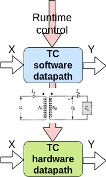
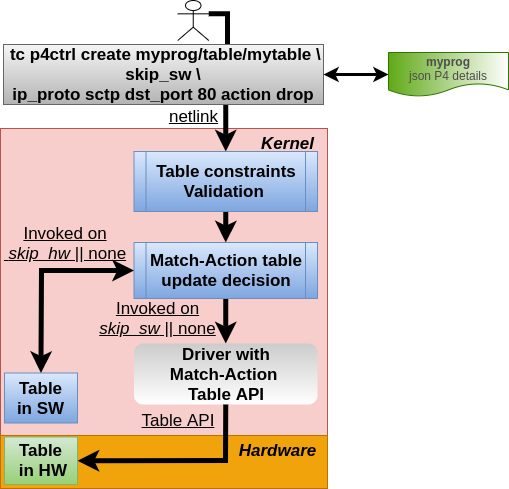
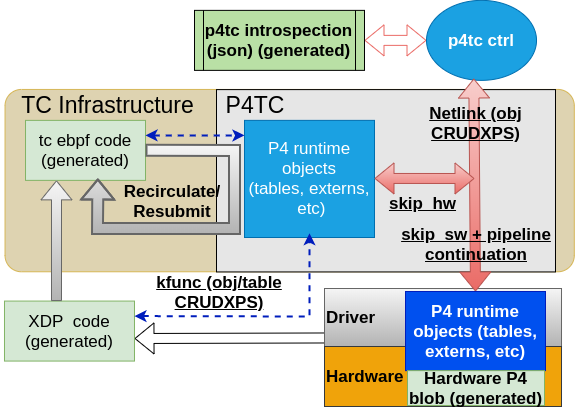

# What Is P4TC You Ask?

A **<u>Scriptable</u>** *Software and Hardware offload of P4 MAT(Match Action Tables) and their Control* using the kernel TC infrastructure.

Both user space *Control* and Kernel *Datapath* are **scripted** (<u>not compiled</u>).

This means (once the P4TC iproute2 and kernel part are upstreamed) there is no
kernel or user space dependency for any P4 program that describes a new datapath.
i.e. introducing a new datapath is a matter of creating shell scripts for the
relevant P4 program with no kernel or userspace code change. While these shell
scripts can be manually created, it is simpler to use the *P4C*([P4C][], [P4C2][])
compiler to generate them (See Workflow section for details).

Any hardware offload in the TC world requires a functionally equivalent software
implementation as illustrated.
This means A packet X input would expect the same transformation with an output
result of Y whether that packet arrives in the kernel datapath or hardware offloaded
datapath. Our initial goal in this project is to cater for the kernel software datapath
and after upstreaming focus on hardware offload. The P4 kernel s/w datapath stands on its
own merit (despite TC providing infra for both).

Note: We have recently done a lot of work to integrate eBPF as a software datapath.
The result of our work was presented to 2023 P4 Workshop in Santa Clara.
See: https://github.com/p4tc-dev/docs/blob/main/p4-conference-2023/2023P4WorkshopP4TC.pdf
XXX: More updates on this work to be added...

## The Challenges With Current Linux Offloads

The Linux kernel already supports offloads for several TC classifiers, including
but not limited to, *flower*([ref3][], [ref1][]) and *u32*([ref4][], [ref5][]).

Flower has become quiet popular and is supported by a wide variety of NICs and
switches([ref2][], [ref6][], [ref7][], etc). For this reason we will stick
to using *flower* to provide context for P4TC.

The diagram below illustrates a high level overview of TC MAT runtime offload
for the flower classifier (all the other offloadable classifiers follow the same
semantics).

The example demonstrates a user adding a table entry on the ingress of device
*eth0* to match a packet with header fields *ethernet type ip, ip protocol SCTP
and destination port 80*. Upon a match the packet is *dropped*.
Observe that the match entry abstraction exists both in hardware and in the
kernel; the user gets to select whether to install an entry in the kernel,
hardware or both.
In the illustrated example, the entry skips the software table (keyword *skip_sw*)
and is installed only in the hardware table. To install the
entry only in the kernel/software table the keyword *skip_hw* is used. When
neither *skip_sw* or *skip_hw* is specified the kernel attempts to install the
entry both in s/w and h/w (it may fail on the hardware side if there are no more
resources available to accommodate the table entry).

Note: A wide variety of other kernel-based offload approaches for various
other subsystems exist including switchdev([switchdev][]), TLS, IPSEC, MACsec,
etc. For sake of brevity we wont go into any details of these mechanisms.

### So What Is Wrong With Current Kernel Offload Approaches?

While the open source community development approach has helped to commoditize
offloads and provide stability, it is also a double edged sword; it comes at a
cost of a slower process and enforced rigidity of features.

Often the hardware has datapath capabilities that are hard or impossible to
expose due to desire to conform to available kernel datapath abstractions.
In particular this is contentious with newer hardware features which were
not designed (by vendors) with the thought "how would this work with the Linux kernel?".
Extending the kernel (to support these new features) by adding new extensions
in the kernel takes an unreasonably long time to upstream because care needs to
be taken to ensure backward compatibility, etc.

But even when datapath offload frameworks exist and are mostly sufficient,
for example the TC architecture, adding small extensions is non-trivial for the
same (process) reasons.
As an example, when an enterprise consumer requires a simple offload match to
extend the tc *flower* classifier with the end goal to eventually be supported by
a distro vendor such as RH, Ubuntu, SUSE etc it could take **multiple years**
for such a feature to show up in the enterprise consumer's network.
Adding a basic header field match offload for flower (as trivial as that may sound),
requires:

1. patching the kernel flow dissector,

2. patching the tc flower user space code,

3. patching the tc flower kernel code

4. patching the driver code

5. convincing the subsystem owners to agree on the changes.

The process is a rinse-repeat workflow which requires not only for perseverance but
also above average social and technical skills of the developers and associated management.

Simply put: The current kernel offload approach and process is not only costly
in time but also expensive in personnel requirements.

#### So What Are The Alternatives? And Are They Any Better?

These kernel challenges have enabled a trend to bypass the kernel altogether and
move to user space with solutions like DPDK. Unfortunately such bypass approaches
are not good for the consumer since they are encumbered with vendor-specific APIs
and object abstractions. If you pick a specific vendor, you are essentially locked
into their API.
OTOH, the kernel provides a _stable, well understood single API and abstraction_
for offloaded objects regardless of the hardware vendor.

Due to supply chain challenges (which were exercabeted by the COVID pandemic)
the industry is trending to a model where consumers purchase NICs from multiple
vendors. Imagine the operational complexity of building out infrastructure with
different vendor NICs each with their own interfaces and tooling in comparison
to vendor-agnostic, well understood tooling in the kernel world.

Summary:  Clearly, a single abstraction for both control and datapath as offered
by the kernel approach is a less costly and appealing from an operational/deployment
perspective.

#### There Is No *one-model-fits-all* Network Datapath

Network datapath deployments tend to be very specific to the applications they
serve. But even when serving similar applications, two different organizations may
end up deploying different datapaths due to organizational capabilities or culture.
See for example some of the big cloud vendors for a sample space.... they are all
different. Basically Conway's law applies[https://en.wikipedia.org/wiki/Conway%27s_law].
Typically this desire translates into request for just this "one feature" that
perhaps nobody else needs but makes a lot of sense for that one organization.
These `one-offs` are abundant and the current upstream process does not bode
well for such requirements due to the process requirements upstream.

The emergence of "programmable switches" and NICs/xPUs([ref11][], [ref12][],
[ref13][], [ref14][], [ref15][]) has exacerbated this process challenge because
now a consumer can finally cater to their organization's network exact requirements
by programming how the hardware executes a specified datapath. From a simplistic
PoV: think of being provided a hardware canvas and you can describe the packet
processing semantics for that hardware using the P4 language and architecture.

### So Why P4 And How Does P4 Help Here?

P4 is the *only* widely deployed specification that is capable of defining
datapaths.

By "datapath definition" we mean not only the ability to specify the
match-action tables, but also the control of conditions that glue them together
in a pipeline traversal by a candidate packet.
We take advantage of the TC match-action architecture ([ref8][], [ref9][])
which satisfies a lot of the proven foundational requirements which P4TC builds on.

P4 is capable of describing a wide range of datapaths so much so that
large NIC consumers such as Microsoft ([ref10][]), Google ([P42023][]), and others have opted
to specifying their hardware datapath requirements to NIC vendors (or even internally in their
own orgs) with P4. It is essentially the HAL formal definition.

From this perspective:
Think of a P4 program as an *abstraction language for the datapath* i.e
it describes the *datapath behavior*. And think of P4TC as manifesting the datapath
definition for both hardware offloading and kernel/software.

While P4 may have shortcomings it is the only game in town and we are compelled
enough to add support for it in the kernel.
P4TC intends to meet the P4 spec requirements but additionally allow for going
beyond P4 from a network programmability PoV.

#### Historical Perspective for P4TC

Desire to get P4 over TC has resulted in many disussions in the community over
many years and we are finally living up to the rhetoric with P4TC:

 - Netdev 0.1(Ottawa, 2015)

   Mihai Budiu, "P4:  specifying  data planes", https://legacy.netdevconf.info/0.1/docs/mihai-budiu-netdev01-p4.pdf

   Mihai Budiu, "P4  demo: a basic L2/L3 switch in 170 LOC", https://legacy.netdevconf.info/0.1/docs/mihai-budiu-netdev01-p4-demo.pdf

 - Many informal hallway and online discussions Netdev 1.1 and 1.2 (2016)

 - Netdev 2.2 (Seoul, 2017)

   Matty Kadosh, "P4 Offload", https://legacy.netdevconf.info/2.2/slides/salim-tc-workshop04.pdf

   Prem Jonnalagadda, "Mapping tc to P4", https://legacy.netdevconf.info/2.2/slides/salim-tc-workshop06.pdf

 - ONF 5th Workshop(Stanford, 2018)

   Jamal Hadi Salim, "What P4 Can Learn From Linux Traffic Control", https://opennetworking.org/wp-content/uploads/2020/12/Jamal_Salim.pdf

 - First ever workshop dedicated for P4 over TC discussion, Intel, Santa Clara, 2018

   Many Speakers (Barefoot, Intel, Cumulus, Melanox, Vmware, Mojatatu, and others), https://files.netdevconf.info/d/5aa8c0ca61ea4e96bb46/

 - Netdev 0x12 (Montreal, 2018)

   Antonin Bas and R. Krishnamoorthy, "Instrumenting P4 in the Kernel" https://www.files.netdevconf.info/d/9535fba900604dcd9c93/files/?p=/Instrumenting%20P4%20in%20the%20Linux%20kernel.pdf

 - Netdev 0x13 (Prague, 2019)

   Marian Pritsak and Matty Kadosh, "P4 Compiler Backend for TC", https://legacy.netdevconf.info/0x13/session.html?p4-compiler-backend-for-tc

### So Where Does P4TC Play?

A major objective of P4TC is to use P4 to prescribe datapaths and additionally
address all the challenges mentioned earlier in regards to the current kernel
offload approach.

For starters: P4 allows us to expose hardware features using a custom defined
datapath without dealing with the consequence of constrained kernel datapaths.
This provides us with an opportunity to describe only the features we need in
the hardware and no more. P4TC provides the datapath semantics that expose P4
abstraction.

From a P4TC perspective, the hardware implementation *does not* have to be P4
capable as long as it abstracts out the behavior described in a specified P4
program. The user/control plane interfaces with the (P4) abstraction of a
pipeline and how the packet flows across MATs - and it is upto the vendor's
driver to transform that abstraction and its associated objects to its hardware
specifics.

To address the upstream process challenge mentioned earlier:
P4TC provides stability by outsourcing the datapath abstraction semantics to P4
while maintaing the well understood offload semantics provided by TC.

P4TC also introduces *user and kernel independence* for additional extensions to
the MAT architecture by using the concept of **scriptability**. This helps us
not having to deal with kernel or user space fixed abstractions.

#### How Does A P4 Offload Differ From Classical TC?

Other than reusing the *tc* utility, P4TC reuses the offload mechanisms exposed
by TC. To compare, the diagram below illustrate on the left hand
how one would offload using flower and on the right handside with P4TC.

<table>
  <tr>
    <td>Offloading using TC flower</td>
    <td>Offloading to a P4 table</td>
  </tr>
  <tr>
    <td valign="top"></td>
    <td valign="top"></td>
  </tr>
</table>

There are a few subtle differences to note: The TC Flower approach
is "rules based" and P4TC takes a more "tables based" approach.
Typically for offload purposes the driver will transform map a TC flower
"rule" into a "table entry" using the rule's chain ID, priority (and combination
of masks).
Whereas P4TC directly deals with table entries which are roughly mapped to a
classical H/W TCAM.

The second difference is that the table in P4TC belongs to the system/ASIC i.e
it is not tied to a netdev/port but rather global and can be shared by many netdevs;
observe that, in contrast to flower, when referencing a table entry (such as in
the creation of a table entry above) there is no mention of the *netdev* or even
*tc block*. From that perspective, the semantics are closer to *tc block* PoV
with the exception that a P4TC table can appear in multiple tc blocks as well as
(in/egress) directions.

Other than you get the same look and feel programming P4TC tables as if you are
programming flower entries.

##### Ok, So Then How Would A P4TC Datapath Look Like At Runtime?

P4TC implements a TC classifier to instantiate a P4 pipeline.

<table>
  <tr>
    <td>1. Instantiating a P4 Pipeline</td>
    <td>2. Offloading to a P4 table</td>
  </tr>
  <tr>
    <td valign="top"></td>
    <td valign="top"></td>
  </tr>
</table>

The figure on the left above illustrates how an *installed* (more on this later)
program is *instantiated*: i.e one would have to *activate* the pipeline on one
or more ports using the TC *P4* classifier.
You can populate the tables anytime after the program is *installed* (more on
this later) before it is *activated*; however, these tables will only be used
once their respective pipeline is instantiated (as shown above on the left).

#### Sorry, What Is *scriptability* Again?

There are two aspects to scriptability: kernel and user space.

##### Kernel Independence

Ok, there is nothing magical about ability to script datapath computations in
the TC world in the kernel. There are many existing samples that the
TC savy folks will recognize:

 - Think about the tc *u32* classifier which, as you know, can be taught how to
   parse and match on arbitrary packet headers with zero kernel or user space
   changes.

 - Think of the tc *pedit* action which, as you know, can be taught to edit or
   compute operations based on arbitrary packet headers with zero kernel or user
   space changes.

 - Think a programmable *skbedit* tc action where you can Read/Write from/to
   arbitrary packet metadata with zero kernel or user space changes.

Next:
…Think of all those designed from day 1 with intention to define arbitrary
 datapath and associated processing as defined by P4.

 ⇒  From a kernel perspective, that is what P4TC scriptability is about….
    You write a script to describe your datapath and logical packet flow.

##### User Space Independence

P4TC also offers user-space/control independence with "scriptability".

Note that on the left top corner of the diagram "Offloading to a P4 table" is
some entity labelled as **myprogram** *json P4 details*. The json file is
generated by the P4 compiler to express details of the attributes
that **myprogram** uses in the P4 program (tables, actions, etc). For the example
illustrated, the json file will describe:

 - that there is a table called *mytable* (as derived from **myprogram.p4**).
 - that the table has a key with name *ip/dstAddr* (which we can shorten)
   and that it is of type IPV4 address.
 - that the table supports an action called *drop* (which takes no parameters)

*Introspection*([IS][])is essentially the activity involved in taking user input and
querying the json file for details and then transforming the information from
the json file into a binary input to be transported to the kernel.

The consequences of introspection are: we do not have to update iproute2 code
for any new headers, etc.

##### Ok, So How Does This Simplify Things?

For the non-TC savy but P4-savy folks: P4TC intends to solve the upstream process
bottleneck by allowing for creating shell scripts which contain TC commands that
describe the P4 behavior with zero kernel or user space changes.

With that being said: The P4TC solution will go beyond traditional P4 in the
focus for network programmability - we hope that we can grow the network
programmability paradigm by marrying Linux and P4 and that some of these
experiences can be brought into P4 proper over time.

### So I Am Intrigued - How Do I Get **myprogram** *Installed* Into The Kernel?

You can use the open source *P4C*([P4C][], P4C2][]) compiler which supports
generating P4TC templates.

<table>
  <tr>
    <td>Creating And Loading P4TC Program Template</td>
  </tr>
  <tr>
    <td valign="top"></td>
  </tr>
</table>

#### Workflow for a P4 Developer
 1. Author writes the P4 program, *myprogram*.
 2. Generate the P4TC templates for *myprogram* (using *P4C*) targeting P4TC.
 3. Author/dev executes the tc template scripts (using their favorite shell scripting)
    to “install P4 program, *myprogram*” into the kernel.

#### Linux Ops approach
 1. Manually create tc template scripts for *myprogram*
 2. Execute the tc template scripts (using their favorite shell scripting)
    to “install P4 program, *myprogram*” into the kernel.

For complex programs it makes a lot of sense to use the compiler.
The other advantage of the compiler is you can generate the hardware equivalent
program that gets loaded into the hardware.

## For More Details...

See netdevconf 0x16 discussions:
  - overview: https://netdevconf.info/0x16/session.html?Your-Network-Datapath-Will-Be-P4-Scripted
  - workshop: https://netdevconf.info/0x16/session.html?P4TC-Workshop

code:
  - kernel code: https://github.com/p4tc-dev/linux-p4tc-pub
  - iproute2 code: https://github.com/p4tc-dev/iproute2-p4tc-pub

Our automated testing consists of:

- CICD which includes several hundred tdc testcases; the workflow is described here:
https://github.com/p4tc-dev/docs/blob/main/p4tc-workshop-0x16-slides/p4_tc%20netdev%20workshop%20slides.pdf 

  CICD runs on X86 and ARM as well as emulated s390 (to test for BE) following a
  workflow described above.

- Syszkaller (on dedicated 24/7 X86), see https://github.com/p4tc-dev/syzkaller-p4tc

- performance evaluation for control plane, see: https://github.com/p4tc-dev/perf-tests

- We are working on a datapath test tool whose artifacts will be generated by
  the *P4C* compiler.

XXXX: links here..

## References

[ref1]: https://legacy.netdevconf.info/2.2/session.html?horman-tcflower-talk	"TC Flower offload"
[ref2]: https://github.com/Mellanox/mlxsw/wiki/ACLs	"MLX switch"
[ref3]: https://man7.org/linux/man-pages/man8/tc-flower.8.html	"flower man page"
[ref4]: https://man7.org/linux/man-pages/man8/tc-u32.8.html	"u32 man page"
[ref5]: https://legacy.netdevconf.info/0x13/session.html?talk-tc-u-classifier	"u32 classifier"
[ref6]: https://docs.nvidia.com/networking/display/MLNXOFEDv473290/OVS+Offload+Using+ASAP2+Direct	"Nvidia NICs"
[ref7]: https://www.netronome.com/media/documents/WP_OVS-TC_.pdf	"Netronome NICs"
[switchdev]: https://www.kernel.org/doc/Documentation/networking/switchdev.txt	"switchdev"
[ref8]: https://opennetworking.org/wp-content/uploads/2020/12/Jamal_Salim.pdf "JHS, 2018 P4 Workshop"
[ref9]: https://legacy.netdevconf.info/0.1/sessions/21.html "TC Classifier Action Subsystem"
[ref10]: https://github.com/Azure/DASH "Azure DASH project"
[ref11]: https://www.intel.ca/content/www/ca/en/products/network-io/programmable-ethernet-switch/tofino-series.html "Tofino Switch"
[ref12]: https://www.nvidia.com/en-us/networking/products/data-processing-unit/ "Nvidia BlueField"
[ref13]: https://www.intel.ca/content/www/ca/en/products/details/network-io/ipu/e2000-asic.html "Intel Mount Evans"
[ref14]:  https://www.marvell.com/products/data-processing-units.html "Marvel DPU"
[ref15]:  https://www.xilinx.com/applications/data-center/network-acceleration.html  "Xilinx NICs"
[P4C]:  https://github.com/p4lang/p4c  "P4C"
[P4C2]:  https://github.com/p4tc-dev/docs/blob/main/p4tc-workshop-0x16-slides/P4_Compiler_Backend_for_P4TC_NetDev.pdf  "P4C2"
[IS]: https://github.com/p4tc-dev/docs/blob/main/p4tc-workshop-0x16-slides/Introspection.pdf "Introspection"
[P42023]:  https://www.youtube.com/watch?v=bk2i1Y42wls "Google P4 2023 Workshop"
