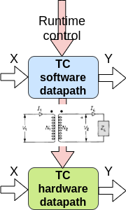
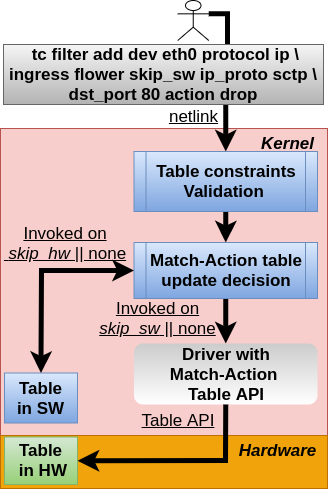
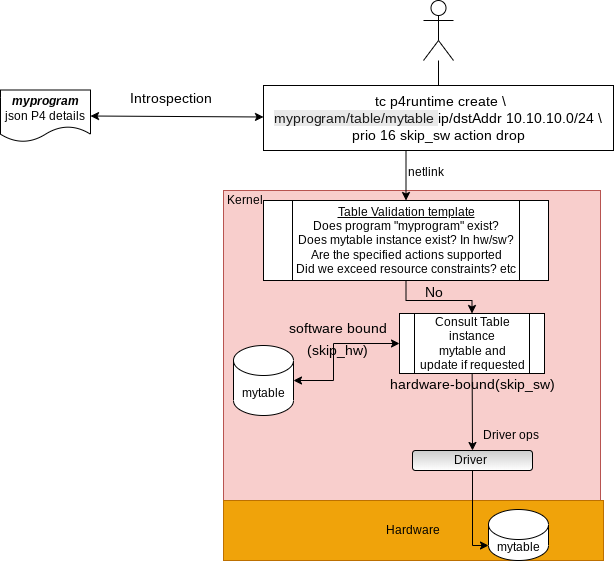
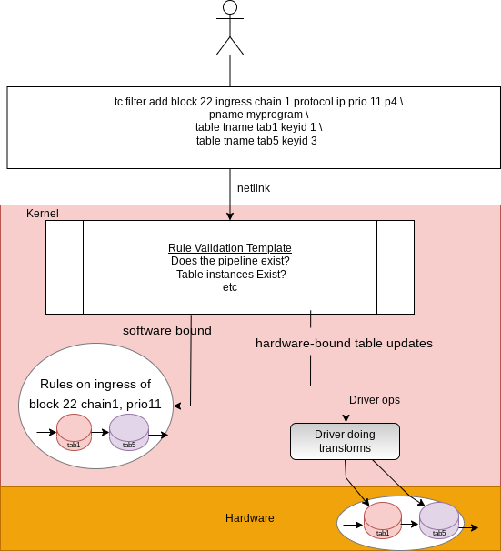
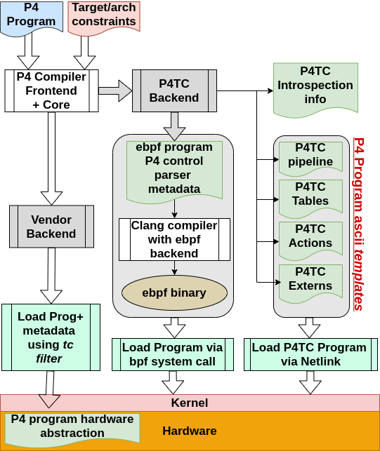
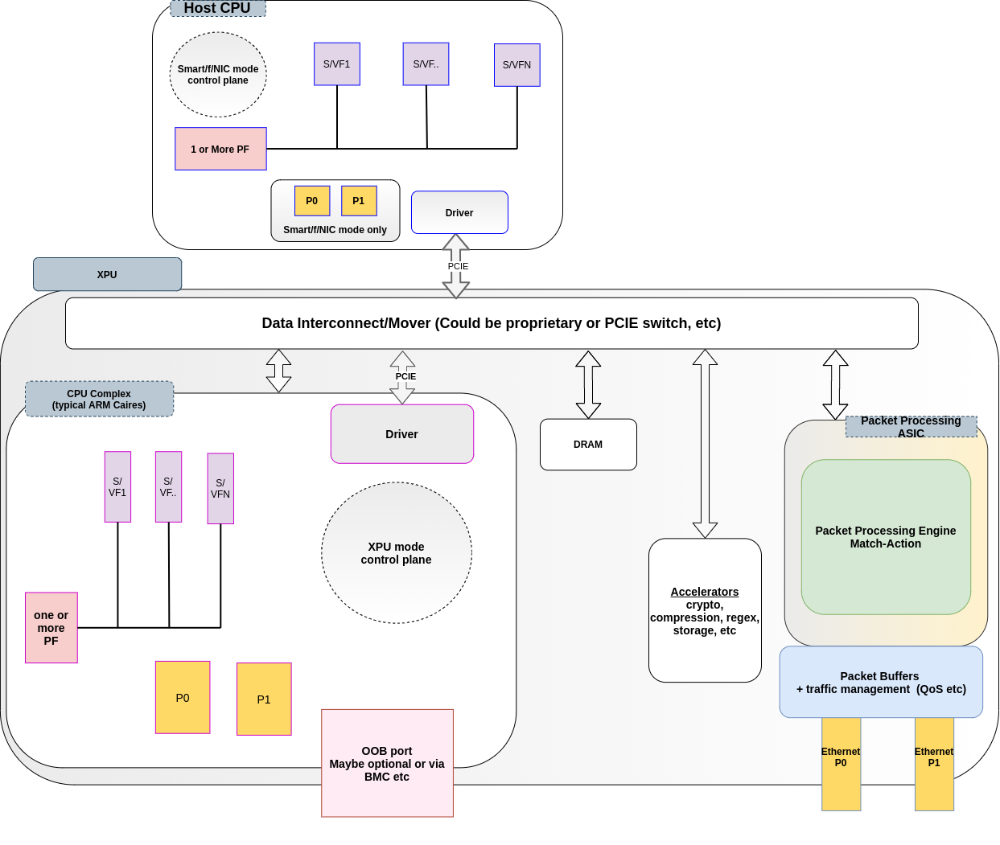

# What Is P4TC You Ask?

The original version of P4TC was scriptable and is described [here](scriptable-why-p4tc.md).
The main difference with the current version is migration of the software
datapath from a scriptable tc u32-like approach to eBPF. For analysis of our
migration to eBPF, see:
https://github.com/p4tc-dev/docs/blob/main/p4-conference-2023/2023P4WorkshopP4TC.pdf
and: https://netdevconf.info/0x17/sessions/talk/integrating-ebpf-into-the-p4tc-datapath.html

P4TC is a net-namespace aware P4 implementation over TC. A P4 program and
its associated objects and state are attached to a kernel _netns_ structure.
IOW, if we had two programs across netns' or within a netns they have no
visibility to each others objects (unlike for example TC actions whose kinds are
"global" in nature or eBPF maps visavis visibility on bpftool).

P4TC builds on top of many years of Linux TC experiences of a netlink control
path interface coupled with a software datapath with an equivalent offloadable
hardware datapath.

Any hardware offload in the TC world requires a functionally equivalent software
implementation as illustrated below.

A packet X input would expect the same transformation with an output result of Y
whether that packet arrives in the kernel datapath or hardware offloaded datapath.

The P4TC software datapath uses eBPF accessing P4 objects that require control
interface residing in the P4TC domain. In the tradition of TC offloads, both the
hardware and software use the same control path interfaces, semantics and
tooling.

The TC equivalence model provides expressive features where one could split
the P4 pipeline processing between software and hardware; or alternatively,
entirely in software or hardware. Think of taking a P4 pipeline and fitting
it into one or all of: the hardware, XDP and TC.
Another perspective of the equivalence model is to facilitate digital twins of
the datapath: You can run the P4 pipeline entirely in software to emulate a
datapath that is running in production offloaded to one or more vendor hardware
with zero code changes.

## The Challenges With Current Linux Offloads

The Linux kernel already supports offloads for several TC classifiers, including
but not limited to, *flower*([ref3][], [ref1][]) and *u32*([ref4][], [ref5][]).

Flower has become quiet popular and is supported by a wide variety of NICs and
switches([ref2][], [ref6][], [ref7][], etc). For this reason we will stick
to using *flower* to provide context for P4TC.

The diagram below illustrates a high level overview of TC (Match-Action Table)
MAT runtime offload for the flower classifier (all the other offloadable
classifiers follow the same semantics).

The example demonstrates a user adding a table entry on the ingress of device
*eth0* to match a packet with header fields *ethernet type ip, ip protocol SCTP
and destination port 80*. Upon a match the packet is *dropped*.
Observe that the match entry abstraction exists both in hardware and in the
kernel; the user gets to select whether to install an entry in the kernel,
hardware or both.
In the illustrated example, the entry skips the software table (keyword *skip_sw*)
and is installed only in the hardware table. To install the
entry only in the kernel/software table the keyword *skip_hw* is used. When
neither *skip_sw* or *skip_hw* is specified the kernel attempts to install the
entry both in s/w and h/w (it may fail on the hardware side if there are no more
resources available to accommodate the table entry).

Note: A wide variety of other kernel-based offload approaches for various
other subsystems exist including switchdev([switchdev][]), TLS, IPSEC, MACsec,
etc. For sake of brevity we wont go into any details of these mechanisms.

### So What Is Wrong With Current Kernel Offload Approaches?

While the open source community development approach has helped to commoditize
offloads and provide stability, it is also a double edged sword; it comes at a
cost of a slower upstream process and enforced rigidity of features.

Often the hardware has datapath capabilities that are hard or impossible to
expose due to desire to conform to available kernel datapath abstractions.
In particular this is contentious with newer hardware features which were
not designed (by vendors) with the thought "how would this work with the Linux kernel?".
Extending the kernel (to support these new features) by adding new extensions
in the kernel takes an unreasonably long time to upstream because care needs to
be taken to ensure backward compatibility, etc - and not to forget that as in
any large communities the kernel community is rife with folks with strongs
points of views which could lead to long tangent discussions (a "condition"
often refered to as [bikeshed][]).

But even in cases where datapath offload frameworks exist and are mostly
sufficient, for example the TC architecture, anytime small extensions are
required it is non-trivial to adapt-to for the same (process) reasons.
As an example, when an enterprise consumer requires a simple offload match to
extend the tc *flower* classifier with the end goal to eventually be supported
by a distro vendor such as RH, Ubuntu, SUSE etc it could take **multiple years**
for such a feature to show up in the enterprise consumer's network.
Adding a basic header field match offload for flower (as trivial as that may
sound), requires:

1. patching the kernel flow dissector,

2. patching the tc flower user space code,

3. patching the tc flower kernel code

4. patching the driver code

5. convincing the subsystem owners to agree on the changes.

The process is a rinse-repeat workflow which requires not only for perseverance but
also above average social and technical skills of the developers and associated management.

Simply put: The current kernel offload approach and process is not only costly
in time but also expensive in personnel requirements. In fact some folks implement
datapaths in user space to bypass the kernel process altogether (and not for the
most often cited reason of performance).

#### So What Are The Alternatives? And Are They Any Better?

These kernel challenges have "empowered" a trend to bypass the kernel altogether and
move to user space with solutions like DPDK. Unfortunately such bypass approaches
are not good for the consumer since they are encumbered with vendor-specific APIs
and object abstractions. If you pick a specific vendor, you are essentially locked
into their API.
OTOH, the kernel provides a _stable, well understood single API and abstraction_
for offloaded objects regardless of the hardware vendor - which has been proven
in deployments (with exception of the process issues being a hindrance).

Due to supply chain challenges (which were exercabeted by the COVID pandemic)
the industry is trending to a model where consumers purchase NICs from multiple
vendors. Imagine the operational complexity of building out infrastructure with
different vendor NICs each with their own interfaces and tooling in comparison
to vendor-agnostic, well understood tooling in the kernel world.

Summary:  Clearly, a single abstraction for both control and datapath as offered
by the kernel approach is a less costly and appealing from an operational/deployment
perspective.

#### There Is No *one-model-fits-all* Network Datapath

Network datapath deployments tend to be very specific to the applications they
serve. But even when serving similar applications, two different organizations may
end up deploying different datapaths due to organizational capabilities or culture.
See for example some of the big cloud vendors for a sample space.... they are all
different. Basically Conway's law applies[https://en.wikipedia.org/wiki/Conway%27s_law].
Typically this desire translates into request for just this "one feature" that
perhaps nobody else needs but makes a lot of sense for that one organization.
These `one-offs` are abundant and the current upstream process does not bode
well for such requirements due to the process requirements upstream.

The emergence of "programmable switches" and NICs/xPUs([ref11][], [ref12][],
[ref13][], [ref14][], [ref15][]) has exacerbated this process challenge because
now a consumer can finally cater to their organization's network exact requirements
by programming how the hardware executes a specified datapath. From a simplistic
PoV: think of being provided a hardware canvas and you can describe the packet
processing semantics for that hardware using the P4 language and architecture.

### So Why P4 And How Does P4 Help Here?

P4 is the *only* widely deployed specification that is capable of defining
datapaths. In fact two major NIC vendors Intel [ref16][] and AMD [ref17][]
produce "P4-native" NICs today.

By "datapath definition" we mean not only the ability to specify the
match-action tables, but also the control of conditions that glue them together
in a pipeline traversal by a candidate packet.
We take advantage of the TC match-action architecture ([ref8][], [ref9][])
which satisfies a lot of the proven foundational requirements which P4TC builds on.

P4 is capable of describing a wide range of datapaths so much so that
large NIC consumers such as Microsoft ([ref10][]), Google ([P42023][]), and others have opted
to specifying their hardware datapath requirements to NIC vendors (or even internally in their
own orgs) with P4. It is essentially the HAL formal definition.

From this perspective:
Think of a P4 program as an *abstraction language for the datapath* i.e
it describes the *datapath behavior*. And think of P4TC as manifesting the datapath
definition for both hardware offloading and kernel/software.

While P4 may have shortcomings it is the only game in town and we are compelled
enough to add support for it in the kernel.
P4TC intends to meet the P4 spec requirements but additionally allow for going
beyond P4 from a network programmability PoV.

#### Historical Perspective for P4TC

Desire to get P4 over TC has resulted in many disussions in the community over
many years and we are finally living up to the rhetoric with P4TC:

 - Netdev 0.1(Ottawa, 2015)

   Mihai Budiu, "P4:  specifying  data planes", https://legacy.netdevconf.info/0.1/docs/mihai-budiu-netdev01-p4.pdf

   Mihai Budiu, "P4  demo: a basic L2/L3 switch in 170 LOC", https://legacy.netdevconf.info/0.1/docs/mihai-budiu-netdev01-p4-demo.pdf

 - Many informal hallway and online discussions Netdev 1.1 and 1.2 (2016)

 - Netdev 2.2 (Seoul, 2017)

   Matty Kadosh, "P4 Offload", https://legacy.netdevconf.info/2.2/slides/salim-tc-workshop04.pdf

   Prem Jonnalagadda, "Mapping tc to P4", https://legacy.netdevconf.info/2.2/slides/salim-tc-workshop06.pdf

 - ONF 5th Workshop(Stanford, 2018)

   Jamal Hadi Salim, "What P4 Can Learn From Linux Traffic Control", https://opennetworking.org/wp-content/uploads/2020/12/Jamal_Salim.pdf

 - First ever workshop dedicated for P4 over TC discussion, Intel, Santa Clara, 2018

   Many Speakers (Barefoot, Intel, Cumulus, Melanox, Vmware, Mojatatu, and others), https://files.netdevconf.info/d/5aa8c0ca61ea4e96bb46/

 - Netdev 0x12 (Montreal, 2018)

   Antonin Bas and R. Krishnamoorthy, "Instrumenting P4 in the Kernel" https://www.files.netdevconf.info/d/9535fba900604dcd9c93/files/?p=/Instrumenting%20P4%20in%20the%20Linux%20kernel.pdf

 - Netdev 0x13 (Prague, 2019)

   Marian Pritsak and Matty Kadosh, "P4 Compiler Backend for TC", https://legacy.netdevconf.info/0x13/session.html?p4-compiler-backend-for-tc

 - Netdev 0x14 (Virtual)

   Nick McKeown's keynote: https://netdevconf.info//0x14/session.html?keynote-mckeown

### So Where Does P4TC Play?

A major objective of P4TC is to use P4 to prescribe datapaths and additionally
address all the challenges mentioned earlier in regards to the current kernel
offload approach.

For starters: P4 allows us to expose hardware features using a custom defined
datapath without dealing with the consequence of constrained kernel datapaths.
This provides us with an opportunity to describe only the features we need in
the hardware and no more. P4TC provides the datapath semantics that expose P4
abstraction.

From a P4TC perspective, the hardware implementation *does not* have to be P4
capable as long as it abstracts out the behavior described in a specified P4
program. The user/control plane interfaces with the (P4) abstraction of a
pipeline and how the packet flows across MATs - and it is upto the vendor's
driver to transform that abstraction and its associated objects to its hardware
specifics.

To address the upstream process challenge mentioned earlier:
P4TC provides stability by outsourcing the datapath abstraction semantics to P4
while maintaing the well understood offload semantics provided by TC.

P4TC also introduces *user and kernel independence* for additional extensions to
the MAT architecture. This helps us not having to deal with kernel or user
space fixed abstractions.

#### How Does A P4 Runtime Differ From Classical TC?

Other than reusing the *tc* utility, P4TC reuses the offload mechanisms exposed
by TC. To compare, the diagram below illustrate on the left hand
how one would install MAT entries using flower and on the right handside with P4TC.

<table>
  <tr>
    <td>TC Flower: Software and Hardware Control</td>
    <td>P4TC: Software and Hardware Control</td>
  </tr>
  <tr>
    <td valign="top"></td>
    <td valign="top"></td>
  </tr>
</table>

There are a few subtle differences to note: The TC Flower approach
is "rules based" and P4TC takes a more "tables based" approach.
Typically for offload purposes the driver will transform map a TC flower
"rule" into a "table entry" using the rule's chain ID, priority (and combination
of masks).
Whereas P4TC directly deals with table entries which are roughly mapped to a
classical H/W TCAM but could be SRAM, DRAM, etc.

The second difference is that the table in P4TC belongs to the system/ASIC i.e
it is not tied to a netdev/port but rather global and can be shared by many netdevs;
observe that, in contrast to flower, when referencing a table entry (such as in
the creation of a table entry above) there is no mention of the *netdev* or even
*tc block*. From that perspective, the semantics are closer to *tc block* PoV
with the exception that a P4TC table can appear in multiple tc blocks as well as
(in/egress) directions.

Other than that you get the same look and feel programming P4TC tables as if you
are programming flower entries. Note: This look-and-feel is intentional so that
someone who is familiar with flower can adapt quickly to p4tc.

#### Ok, So Then How Would A P4TC Datapath Look Like At Runtime?

P4TC implements a TC classifier to manage a P4 pipeline lifetime from instantiation
all the way to destruction. See examples further below on how a P4 program is
instantiated. Once instantiated, the runtime API kicks in.

<table>
  <tr>
    <td>P4 Pipeline Datapath</td>
    <td>P4 Runtime Control</td>
  </tr>
  <tr>
    <td valign="top"></td>
    <td valign="top"></td>
  </tr>
</table>

The figure on the left above illustrates how a P4TC datapath operates after instantiation.
Everything in greenish color (the tc eBPF code, XDP eBPF code, the control json
helper, as well as the hardware program) is compiler generated. Note that
the placement of the different parts of the pipeline is entirely up to the
operator. IOW, you could have software at XDP only or tc only etc or you could
have it in all 3 locations when it makes sense. State across the different
locations is relayed by the tuple of {data, metadata}. However, it should be
note the 3 locations could run entirely different P4 programs.

##### Kernel Independence

The software datapath and control artificats are all generated by the open
source *P4C*([P4C2][], [P4C][]) compiler which supports a P4TC backend.
Unlike flower, no new kernel code is needed for any P4 program regardless of
the datapath behavior described or objects(headers, parsers, etc) introduced.

##### User Space Independence

P4TC also offers user-space/control independence again by virtue of the
*P4C*([P4C2][], [P4C][]) compiler.

Note that on the righ top corner of the diagram "P4 Runtime Control" is
some entity labelled as **myprog** *json P4 details*. The json file is
generated by the P4 compiler to express details of the control attributes
that **myprog** uses in the P4 program (tables, actions, etc). For the example
illustrated, the json file will describe:

 - that there is a table called *mytable* (as derived from **myprog.p4**).
 - that the table has a key with name *ip/dstAddr* (which we can shorten)
   and that it is of type IPV4 address.
 - that the table supports an action called *drop* (which takes no parameters)

*Introspection*([IS][])is essentially the activity involved in taking user input
and querying the json file for details and then transforming the information from
the json file into a binary input to be transported to the kernel.

The consequences of introspection are: we do not have to update iproute2 code
for any new headers, etc.

##### Ok, So How Does This Simplify Things?

For the non-TC savy but P4-savy folks: P4TC intends to solve the upstream process
bottleneck by allowing for creating a shell script which contain TC commands that
describe the P4 behavior and an eBPF s/w datapath with zero kernel or user space
changes. You do not need to be a kernel or eBPF guru either.

For the TC savy folks, we try very hard to maintain TC point of view.

With that being said: The P4TC solution will go beyond traditional P4 in the
focus for network programmability - we hope that we can grow the network
programmability paradigm by marrying Linux and P4 and that some of these
experiences can be brought into P4 proper over time.

### So I Am Intrigued - How Do I Get **myprog** *Installed* Into The Kernel?

You can use the open source *P4C*([P4C2][], [P4C][]) compiler which supports
generating P4TC templates. The workflow is described below:

<table>
  <tr>
    <td>Software And Hardware: Creating And Loading P4TC Program</td>
  </tr>
  <tr>
    <td valign="top"></td>
  </tr>
</table>

#### Workflow
  1 ) A developer writes a P4 program, "myprog"

  2A) Compiles it using the *P4C*([P4C2][], [P4C][]). The compiler generates 3 outputs:
      a) A shell script which form template definitions for the different P4
         objects "myprog" utilizes (tables, externs, actions etc).
      b) the parser and the rest of the datapath are generated as eBPF and need
         to be compiled into binaries. At the moment the parser and the main
         control block are generated as separate eBPF program but this could change in
         the future (without affecting any kernel code).
      c) A json introspection file used for the control plane (by iproute2/tc).

  2B) Compiles using a vendor backend to P4C. We are not going to discuss this
      aspect; focus is to illustrate the s/w side. But do note you could load the
      HW datapath using devlink (FIXME: diagram still showing old scheme usinng tc filter).

  3 ) At this point the artifacts from #2 could be handed to an operator.
     Either the operator is handed the ebpf binary or compiles it.
     The operator executes the shell script(s) to manifest the functional
     "myprog" into the kernel.

  4 ) The operator instantiates "myprog" pipeline via the tc P4 filter
     to ingress/egress (depending on P4 arch) of one or more netdevs/ports
     (illustrated below as "block 22"). Note the tc filter here is used
     to manage the P4 program pipeline (whether we have h/w offload or not).

Several ways to instantiate the s/w datapath:

     Example1: parser is an action:
       "tc filter add block 22 ingress protocol all prio 10 p4 pname myprog \
        action bpf obj $PARSER.o section p4tc/parse \
        action bpf obj $PROGNAME.o section p4tc/main"

     Example2: parser is at XDP, rest of dpath as an action:
       "ip link set $DEV xdp obj $PARSER.o sec p4tc/parse
        tc filter add block 22 ingress protocol all prio 10 p4 pname myprog \
        action bpf obj $PROGNAME.o section p4prog/main"

Note: if you dont need s/w datapath at all there is no need to load the ebpf code.

     Example3: HW only datapath.

       "tc filter add block 22 ingress protocol all prio 10 p4 pname myprog"

#### Deployment Model

The diagram below illustrates the different models of deployment of an I/DPU(XPU) for hardware offload.
There are two ways the P4 datapath can be deployed. We refer to these as *XPU mode* and *smartNIC mode* (depending on the vendor they may refer to it as "functional NIC").

In both cases the relevant driver acts as the interface for the P4 programming i.e the tc infra sends the CRUD requests to the driver which then talks to the hardware. Do note: the illustrated CPUs, whether on the host side(x86 for example) or the NIC side (ARM cores) have a running distro such as debian etc; IOW, the illustrated drivers in the diagram are Linux drivers.

The control of whether you want to run *smartNIC mode* or *XPU mode* is mostly via firmware, although vendors would sell you a "lower end" version which runs entirely on *smartNIC mode* - example you can buy an NVIDIA CX6 NIC for a lower price than buying a Bluefield2, Intel has some similar mode as well.

The 2 modes are mutually exclusive i.e you pick one or the other.

Lets start with *smartNIC mode* because this is what most folks are familiar with. In this case your TC CRUD goes via the host CPU. Your s/w exception path also runs on the host CPU. Summary: The ARM cores and everything else on the NIC side is not accessible directly to you. Infact depending on the NIC model there may even not be ARM cores on that NIC!

In the *XPU mode* the control plane resides in the cpu complex on the NIC (ARM cores in the diagram). So the CRUD commands to manipulate the P4 objects (tables or actions) are issued from the ARM cores. It also means your s/w exception path or pipeline is on the ARM cores.

In both modes, as illustrated above, the driver will have full visibility to the ASIC as a PCI device.

So why is *XPU mode* prefered? There are several reasons:

- Zero Trust of the host. You may not want to allow the host to be mucking around with the s/w datapath especially in shared environments. It is also argued that if your host got hacked having control of the datapath, perhaps patching it with some new tables etc is easier to do within the NIC where an OOB network exists, accessible only to the owners.

- Saving CPU cycles on the host. Instead of spending the host CPU on the "network infra" processing, you free those cycles to allow more to be available to the applications by offloading the "network infra" from the host stack.

- Power savings. The NICs consume a lot less power than host CPUs to achieve the same "network infra" goals.

There is an operational con, however: On a host you now have two distros to manage - one on the host and another on the NIC.

##### Port Model

As illustrated above, we assume a *switchdev* model.

All ports, physical or virtual, fall under two classifications per P4 PNA specs: 1) VFs and SFs representators (or queue-pairs etc) fall under P4 *host ports* or as commonly refered to as *vports* 2) physical ports(example P0 and P1 in the diagram) fall under P4 *network ports* categorization.

Note, creation of VFs in either modes **happens at the host**; SFs on the other hand could be created on the xPU side. This is an ongoing discussion in many other jurisdictions including amongst the vendors discussing the P4TC offloads in the bi-weekly meetings.

In *SmartNIC* mode the physical (network) and vports are all exposed on the host side. The control plane is going to need access to the PF on the host for control.
In *XPU* mode the vports are exposed to both the host as well as cpu complex side but the physical (network) ports(where the cables are connected) are only visible on the cpu complex. The control plane is going to need access to the PF on the ARM cpu complex for control.

##### Operational Model

Regardless of the two modes, the vports, PF and network ports illustrated above could reside on any of the permutations of:

 - Baremetal on *host* or *cpu complex*
 - On the *host* or *cpu complex*, residing in VMs
 - On the *host* or *cpu complex* , residing in containers
 - On the *host* or *cpu complex*, residing in containers which are in VMs

Control plane requires visibility into the PCI device aka PF driver. So PF (and as a consequence control) can be moved to any of the combinations of host/VM/container/cpucomplex as described above.

## For More Details...

See netdevconf 0x17 presentation at:
https://netdevconf.info/0x17/sessions/talk/integrating-ebpf-into-the-p4tc-datapath.html

See EuroP4 paper:
https://github.com/p4tc-dev/docs/blob/main/EuroP4-conference-2023/EuroP4_2023-paper.pdf
https://github.com/p4tc-dev/docs/blob/main/EuroP4-conference-2023/EuroP4_2023-slides.pdf

See netdevconf 0x16 discussions:
  - overview: https://netdevconf.info/0x16/session.html?Your-Network-Datapath-Will-Be-P4-Scripted
  - workshop: https://netdevconf.info/0x16/session.html?P4TC-Workshop

code:
  - kernel code: https://github.com/p4tc-dev/linux-p4tc-pub
  - iproute2 code: https://github.com/p4tc-dev/iproute2-p4tc-pub

Our automated testing consists of:

- CICD which includes several hundred tdc testcases; the workflow is described here:
https://github.com/p4tc-dev/docs/blob/main/p4tc-workshop-0x16-slides/p4_tc%20netdev%20workshop%20slides.pdf

  CICD runs on X86 and ARM as well as emulated s390 (to test for BE) following a
  workflow described above.

- Syszkaller (on dedicated 24/7 X86), see https://github.com/p4tc-dev/syzkaller-p4tc

- performance evaluation for control plane, see: https://github.com/p4tc-dev/perf-tests

- We are working on a datapath test tool whose artifacts will be generated by
  the *P4C* compiler.

## References

[ref1]: https://legacy.netdevconf.info/2.2/session.html?horman-tcflower-talk	"TC Flower offload"
[ref2]: https://github.com/Mellanox/mlxsw/wiki/ACLs	"MLX switch"
[ref3]: https://man7.org/linux/man-pages/man8/tc-flower.8.html	"flower man page"
[ref4]: https://man7.org/linux/man-pages/man8/tc-u32.8.html	"u32 man page"
[ref5]: https://legacy.netdevconf.info/0x13/session.html?talk-tc-u-classifier	"u32 classifier"
[ref6]: https://docs.nvidia.com/networking/display/MLNXOFEDv473290/OVS+Offload+Using+ASAP2+Direct	"Nvidia NICs"
[ref7]: https://www.netronome.com/media/documents/WP_OVS-TC_.pdf	"Netronome NICs"
[switchdev]: https://www.kernel.org/doc/Documentation/networking/switchdev.txt	"switchdev"
[ref8]: https://opennetworking.org/wp-content/uploads/2020/12/Jamal_Salim.pdf "JHS, 2018 P4 Workshop"
[ref9]: https://legacy.netdevconf.info/0.1/sessions/21.html "TC Classifier Action Subsystem"
[ref10]: https://github.com/Azure/DASH "Azure DASH project"
[ref11]: https://www.intel.ca/content/www/ca/en/products/network-io/programmable-ethernet-switch/tofino-series.html "Tofino Switch"
[ref12]: https://www.nvidia.com/en-us/networking/products/data-processing-unit/ "Nvidia BlueField"
[ref13]: https://www.intel.ca/content/www/ca/en/products/details/network-io/ipu/e2000-asic.html "Intel Mount Evans"
[ref14]:  https://www.marvell.com/products/data-processing-units.html "Marvel DPU"
[ref15]:  https://www.xilinx.com/applications/data-center/network-acceleration.html  "Xilinx NICs"
[ref16]:  https://www.intel.com/content/www/us/en/products/details/network-io/ipu/e2000-asic.html "Intel NICs"
[ref17]:  https://www.amd.com/en/accelerators/pensando "AMD NICs"
[P4C]:  https://github.com/p4lang/p4c  "P4C"
[P4C2]: https://github.com/p4lang/p4c/tree/main/backends/tc  "P4C2"
[IS]: https://github.com/p4tc-dev/docs/blob/main/p4tc-workshop-0x16-slides/Introspection.pdf "Introspection"
[P42023]:  https://www.youtube.com/watch?v=bk2i1Y42wls "Google P4 2023 Workshop"
[bikeshed]: http://phk.freebsd.dk/sagas/bikeshed/ "bike shedding"
