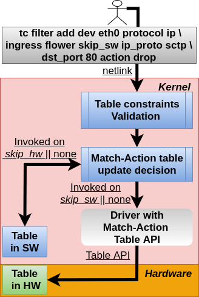
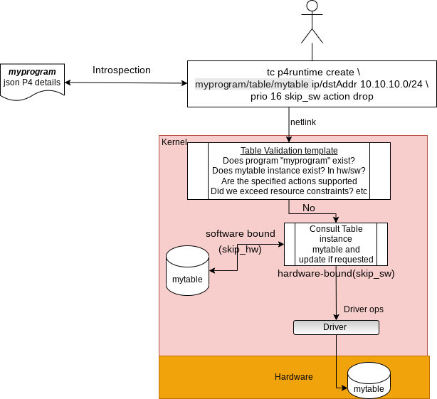
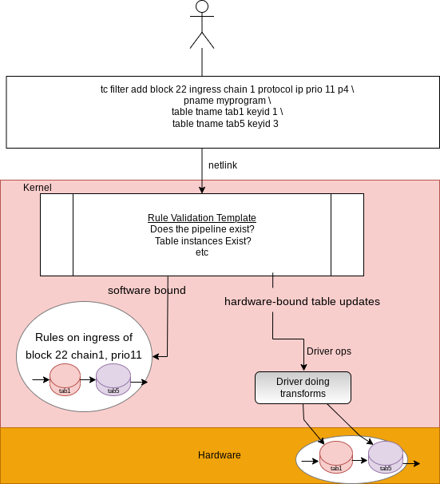

# What Is P4TC You Ask?

A **<u>Scriptable</u>** *Hardware offload of P4 MAT(Match Action Tables) and their Control* using the kernel TC infrastructure.

Both user space *Control* and Kernel *Datapath* are **scripted** (<u>not compiled</u>).

This means (once the P4TC iproute2 and kernel part are upstreamed) there is no
kernel or user space dependency for any P4 program that describes a new datapath.
i.e. introducing a new datapath is a matter of creating shell scripts for the
relevant P4 program with no kernel or userspace code change. While these shell
scripts can be manually created, it is simpler to use the *P4C* compiler to
generate them (See Workflow section for details).

## The Challenges With Current Linux Offloads

The Linux kernel already supports offloads for several TC classifiers, including
but not limited to, *flower*([ref3][], [ref1][]) and *u32*([ref4][], [ref5][]).

Flower has become quiet popular and is supported by a wide variety of NICs and
switches([ref2][], [ref6][], [ref7][], etc). For this reason we will stick
to using *flower* to provide context for P4TC.

The diagram below illustrates a high level overview of TC MAT runtime offload
for the flower classifier (all the other offloadable classifiers follow the same
semantics).

The example demonstrates a user adding a table entry on the ingress of device
*eth0* to match a packet with header fields *ethernet type ip, ip protocol SCTP
and destination port 80*. Upon a match the packet is *dropped*.
Observe that the match table abstraction exists both in hardware and in the
kernel; the user gets to select whether to install an entry in the kernel,
hardware or both.
In the illustrated example, the entry skips the software table (keyword *skip_sw*)
and is installed only in the hardware table. To install the
entry only in the kernel/software table the keyword *skip_hw* is used. When
neither *skip_sw* or *skip_hw* is specified the kernel attempts to install the
entry both in s/w and h/w (it may fail on the hardware side if there are no more
resources available to accommodate the table entry).

Note: A wide variety of other kernel-based offload approaches for various
other subsystems exist including switchdev([switchdev][]), TLS, IPSEC, MACsec,
etc. For sake of brevity we wont go into any details of these mechanisms.

### So What Is Wrong With Current Kernel Offload Approaches?

While the open source community development approach has helped to commoditize
offloads and provide stability, it is also a double edged sword; it comes at a
cost of a slower process and enforced rigidity of features.

Often the hardware has datapath capabilities that are hard or impossible to
expose due to desire to conform to available kernel datapath abstractions.
In particular this is contentious with newer hardware features which were
designed with the thought "how would this work with the Linux kernel".
Extending the kernel (to support these new features) by adding new extensions
takes an unreasonably long time to upstream because care needs to be taken
to ensure backward compatibility, etc.

But even when datapath offload frameworks exist and are sufficient, such as the TC architecture,
adding small extensions is non-trivial for the same (process) reasons.
As an example, when an enterprise consumer requires a simple offload match to
extend the tc *flower* classifier with the end goal to eventually be supported by
a distro vendor such as RH, Ubuntu, SUSE etc it could take **multiple years**
for such a feature to show up in the enterprise consumer's network.
Adding a basic header field match offload (as trivial as that may sound),
requires:

1. patching the kernel flow dissector,

2. patching the tc flower user space code,

3. patching the tc flower kernel code

4. patching the driver code

5. convincing the subsystem owners to agree on the changes.

The process is a rinse-repeat workflow which requires not only for perseverance but
also above average social and technical skills of the developers and associated management.

Simply put: The current kernel offload approach and process is not only costly
in time but also expensive in personnel requirements.

These kernel challenges have enabled a trend to bypass the kernel altogether and
move to user space with solutions like DPDK. Unfortunately such bypass approaches
are not good for the consumer since they are encumbered with vendor-specific APIs
and object abstractions.
OTOH, the kernel provides a _stable, well understood single API and abstraction_
for offloaded objects regardless of the hardware vendor.

Due to supply chain challenges (which were exercabeted by the COVID pandemic)
the industry is trending to a model where consumers purchase NICs from multiple
vendors. Clearly a single abstraction for both control and datapath as offered
by the kernel approach is a less costly and appealing.

Network datapath deployments tend to be very specific to the applications they
serve. But even when serving similar applications, two different organizations may
end up deploying different datapaths due to organizational capabilities or culture.
Basically Conway's law applies[https://en.wikipedia.org/wiki/Conway%27s_law].
Typically this desire translates into request for just this "one feature" that
perhaps nobody else needs. These `one-offs` are abundant and the current
upstream process does not bode well for such requirements due to the process
requirements.

Summary: there is no *one-model-fits-all* network datapath.

The emergence of "programmable switches" and NICs/xPUs([ref11][], [ref12][],
[ref13][], [ref14][], [ref15][]) has exacerbated this process challenge because
now a consumer can finally cater to their organization's network exact requirements
by programming how the hardware executes a specified datapath. From a simplistic
PoV think of being provided a hardware canvas and you can describe the packet
processing semantics for that hardware.

### So Why P4 And How Does P4 Help Here?

P4 is the *only* widely deployed specification that is capable of defining
datapaths.

By "datapath definition" we mean not only the ability to specify the
match-action tables, but also the control of conditions that glue them together
in a pipeline traversal by a candidate packet.
The TC architeture ([ref8][], [ref9][]) also provides a mechanism for construction
of a pipeline using *TC verdict opcodes* (alongside chains and filter priorities);
however, it requires good knowledge of the underlying infrastructure to create
meaningful pipelines. In addition it gets not only cumbersome to construct
slightly complex pipelines but sometimes impossible altogether.

P4 is capable of describing a wide range of datapaths so much so that
large NIC consumers such as Microsoft ([ref10][]) and others have opted
to specifying their hardware datapath requirements to NIC vendors with P4.

From this perspective:
Think of a P4 program as an *abstraction language for the datapath* i.e
it describes the *datapath behavior*. And think of P4TC as manifesting the datapath
definition for both hardware offloading and kernel/software.

While P4 may have shortcomings it is the only game in town and we are compelled
enough to add support for it in the kernel.

### So Where Does P4TC Play?

A major objective of P4TC is to address all the challenges mentioned earlier in
the current kernel offload approach.

For starters: P4 allows us to expose hardware features using a custom defined
datapath without dealing with the consequence of constrained kernel datapaths.
This provides us with an opportunity to describe only the features we need in
the hardware and no more. P4TC provides the datapath semantics that expose P4
abstraction.

From a P4TC perspective, the hardware implementation does not have to be P4
capable as long as it abstracts out the behavior described in a specified P4
program. The user/control plane interfaces with the (P4) abstraction of a
pipeline and how the packet flows across MATs - and it is upto the vendor's
driver to transform that abstraction and its associated objects to its hardware
specifics.

To address the long process challenge mentioned earlier:
P4TC provides stability by outsourcing the datapath abstraction semantics to P4
while maintaing the well understood offload semantics provided by TC.

P4TC also introduces *user and kernel independence* for additional extensions to
the MAT architecture by using the concept of **scriptability**. This helps us
not having to deal with kernel or user space fixed abstractions.

#### How Does A P4 Offload Differ From Classical TC?

P4TC reuses the mechanisms exposed by TC as illustrated below. On the left hand
is how one would offload using flower and on the right handside with P4TC.

<table>
  <tr>
    <td>Offloading to a TC flower Table</td>
    <td>Offloading to a P4 table</td>
  </tr>
  <tr>
    <td valign="top"></td>
    <td valign="top"></td>
  </tr>
</table>

There are a few subtle exceptions. The first one is that the table in P4 belongs
to the system/ASIC i.e it is not tied to a netdev/port. The semantics will be
closer to *tc block* PoV with the exception that a table can appear in multiple
tc blocks as well as directions:  the table in P4 is essentially
"global" and can be programmed independently";
this means that when tied to multiple ports, all ports see exactly the same
table instance.
Other than you get the same look and feel as if you are programming flower entries.

##### Ok, So Then How Would A P4TC Datapath Look Like At Runtime?

P4TC implements a TC classifier to prescribe a P4 pipeline.

<table>
  <tr>
    <td>1. Prescribing a P4 Pipeline</td>
    <td>2. Offloading to a P4 table</td>
  </tr>
  <tr>
    <td valign="top"></td>
    <td valign="top"></td>
  </tr>
</table>

As illustrated, to instantiate an installed(more on this later) program pipeline
one would have to *instantiate* the pipeline on one or more ports. Do note that the
control of table entries is independent of ports or direction (ingress vs egress)
but you have to instantiate the pipeline on one or more ports (either with the
"dev" or "block" semantics). As a matter of fact, once the program is installed
(but not yet instantiated) you can populate the tables - they will only be used
once their respect pipeline is instantiated.

#### Sorry, What Is *scriptability* Again?

There are two aspects to scriptability: kernel and user space.

##### Kernel Independence

Ok, there is nothing magical about ability to script datapath computations in
the TC world in the kernel. There are many existing samples that the
TC savy folks will recognize:

 - Think about the tc *u32* classifier which, as you know, can be taught how to
   parse and match on arbitrary packet headers with zero kernel or user space
   changes.

 - Think of the *pedit* tc action which, as you know, can be taught to edit or
   compute operations based on arbitrary packet headers with zero kernel or user
   space changes.

 - Think a programmable *skbedit* tc action where you can Read/Write from/to
   arbitrary packet metadata with zero kernel or user space changes.

Next:
…Think of all those designed from day 1 with intention to define arbitrary
 datapath and associated processing as defined by P4.

 ⇒  From a kernel perspective, that is what P4TC is about….

##### User Space Independence

Note that on the left top corner of the diagram "Offloading to a P4 table" is
something labelled as **myprogram** *json P4 details*. The json file is
generated by the P4 compiler to express details of the attributes
that **myprogram** uses in the P4 program (tables, actions, etc). For the example
illustrated:

 - that there is a table called *mytable* described in **myprogram.p4**
 - that the table has a key with name *ip/dstAddr* and of type IPV4 address
 - that the table supports an action called *drop* (which takes no parameters)

*Introspection* is essentially the activity involved in taking user input and
querying the json file for details and then transforming the information from
the json file into a binary input to be transported to the kernel.

The consequences of introspection are: we do not have to update iproute2 code
for any new headers, etc.

##### Ok, So How Does This Simplify Things?

For the non-TC savy but P4-savy folks: P4TC intends to solve the upstream process
bottleneck by allowing for creating shell scripts which contain TC commands that
describe the P4 behavior with zero kernel or user space changes.

With that being said: The P4TC solution will go beyond traditional P4 in the
focus for network programmability - we hope that we can grow the network
programmability paradigm by marrying Linux and P4 and that some of these
experiences can be brought into P4 proper over time.

### So I Am Intrigued - How Do I Get **myprogram** *Installed* Into The Kernel?

XXX: more detailed description here..

## References

[ref1]: https://legacy.netdevconf.info/2.2/session.html?horman-tcflower-talk	"TC Flower offload"
[ref2]: https://github.com/Mellanox/mlxsw/wiki/ACLs	"MLX switch"
[ref3]: https://man7.org/linux/man-pages/man8/tc-flower.8.html	"flower man page"
[ref4]: https://man7.org/linux/man-pages/man8/tc-u32.8.html	"u32 man page"
[ref5]: https://legacy.netdevconf.info/0x13/session.html?talk-tc-u-classifier	"u32 classifier"
[ref6]: https://docs.nvidia.com/networking/display/MLNXOFEDv473290/OVS+Offload+Using+ASAP2+Direct	"Nvidia NICs"
[ref7]: https://www.netronome.com/media/documents/WP_OVS-TC_.pdf	"Netronome NICs"
[switchdev]: https://www.kernel.org/doc/Documentation/networking/switchdev.txt	"switchdev"
[ref8]: https://opennetworking.org/wp-content/uploads/2020/12/Jamal_Salim.pdf "JHS, 2018 P4 Workshop"
[ref9]: https://legacy.netdevconf.info/0.1/sessions/21.html "TC Classifier Action Subsystem"
[ref10]: https://github.com/Azure/DASH "Azure DASH project"
[ref11]: https://www.intel.ca/content/www/ca/en/products/network-io/programmable-ethernet-switch/tofino-series.html "Tofino Switch"
[ref12]: https://www.nvidia.com/en-us/networking/products/data-processing-unit/ "Nvidia BlueField"
[ref13]: https://www.intel.ca/content/www/ca/en/products/details/network-io/ipu/e2000-asic.html "Intel Mount Evans"
[ref14]:  https://www.marvell.com/products/data-processing-units.html "Marvel DPU"
[ref15]:  https://www.xilinx.com/applications/data-center/network-acceleration.html  "Xilinx NICs"
